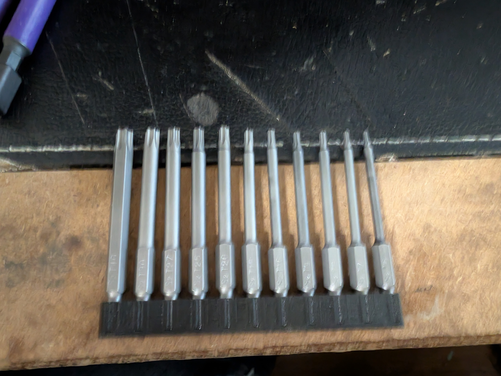

# 11 slot compliant hex bit holder

I needed a holder for some hex bits.  This is designed with a little bit of compliance so the bits don't fall out, but aren't a pain to remove

... That's a terrible picture.