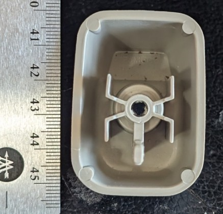

# 2008 Ford F-250 Sunvisor Clip

## As Printed

This is the pretty side after I popped off the support material.  10/10
(Thanks, camera, for focusing on the support material and making the part look like some weird render artifact. :| )

## Finished Part

I had some scarring from the support material so I tried sanding, hot smoothing, and then polishing with acetone.  I think it looked better before I messed with it, but it's still a useful part.

## 3d Print Orientation

To get maximum strength through the thin curved section, I printed it in this orientation. That required support material, but produced the strongest possible part.  With 0.1mm layers, 0.2mm nozzle, Prusa MK3S.  Hypothetically it should also work to print with one side flat on the bed, but I did not attempt it. Printed in Polymaker ASA for thermal resistance for hot Tennessee summers.

## Suggestions for future work

The notch could be closed up a little to better hold the visor.
Removing support material makes a beautiful surface finish awful. Try printing it flat on the side or using multimaterial support.
A resin printer could print this and eliminate the support issue.

## Reference Photos of original

