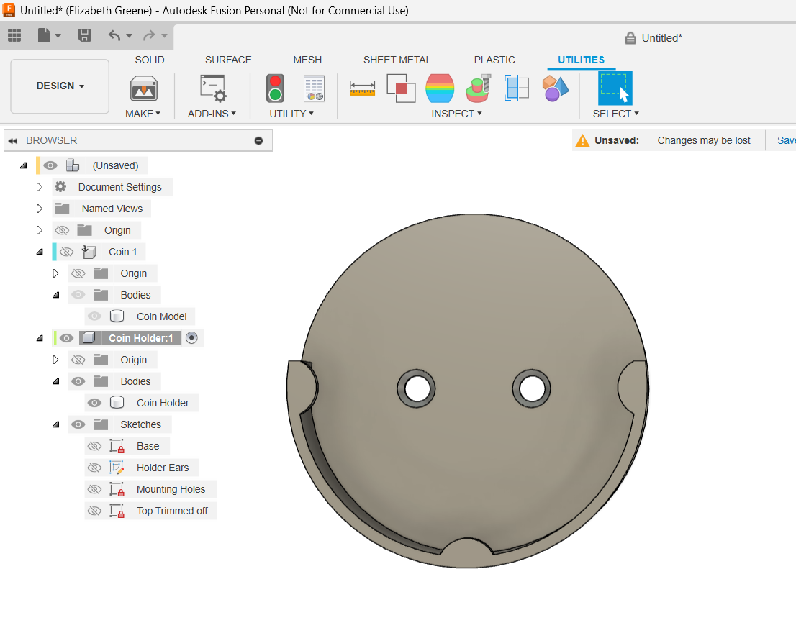

# 45mm coin holder

This is a holder for a commemorative coin I received.  It mounts to my desk with 2 #4 wood screws. A drop of hot glue on each screw head prevent the screws from scratching the coin and prevents it from easily popping out.

Printing requires a tiny amount of support material to support the "ears".

