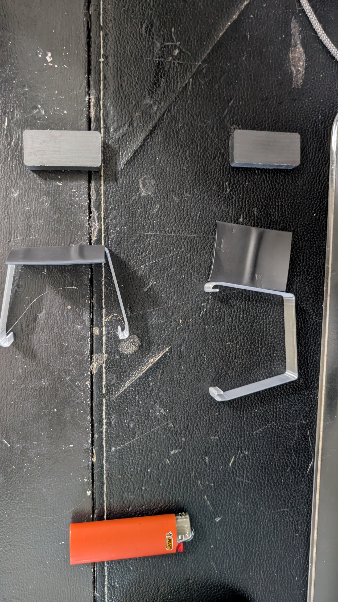
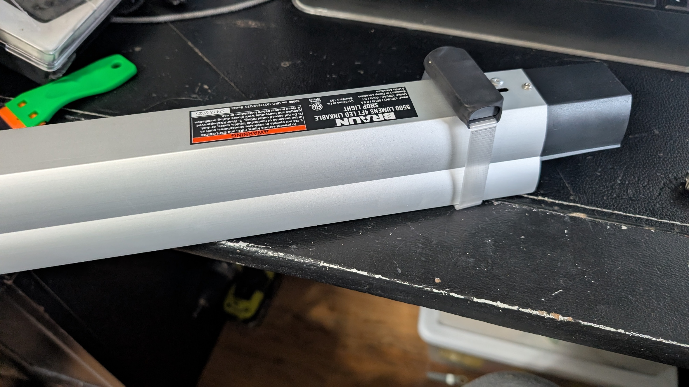
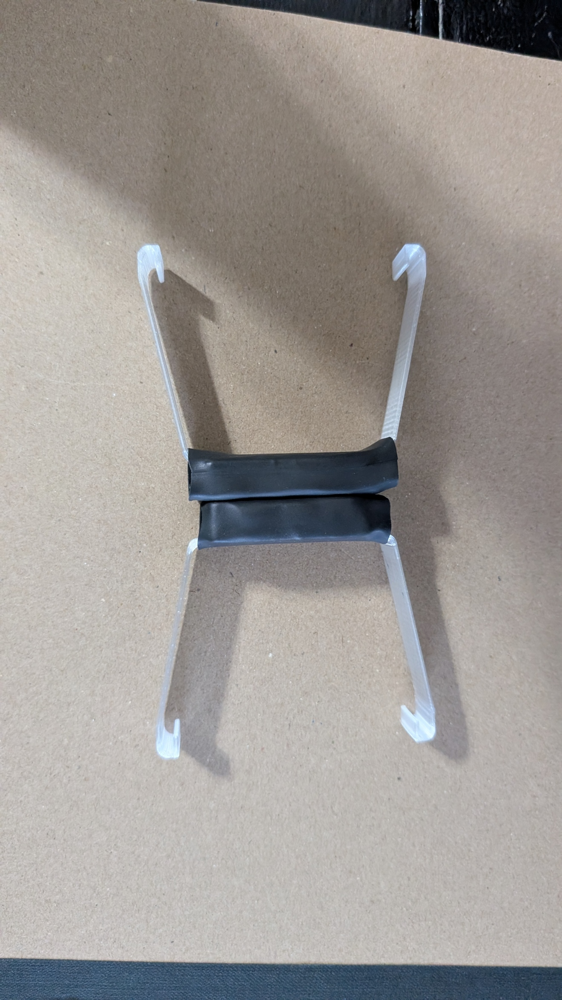

# Bauer Light Magnet Mounts

This project shows a couple of different ways to attach magnets to a BRAUN 4 foot LED shop light.  V2 is a print-in place install magnets while printing and rivet to the light option, but I chose not to go that way.  v3 is a simple snap-fit on the light and the brackets attach to the magnets with heat-shrink tubing.

The magnets are strongest if you orient them so the working faces attract each other.

Two magnets are sufficient to hold the light up, but it falls if you use the pull-chain.  With 4 magnets it's perfect.
