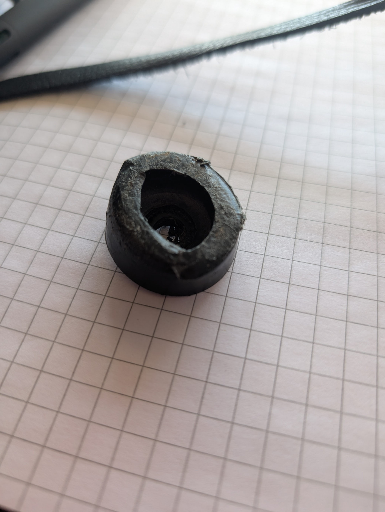
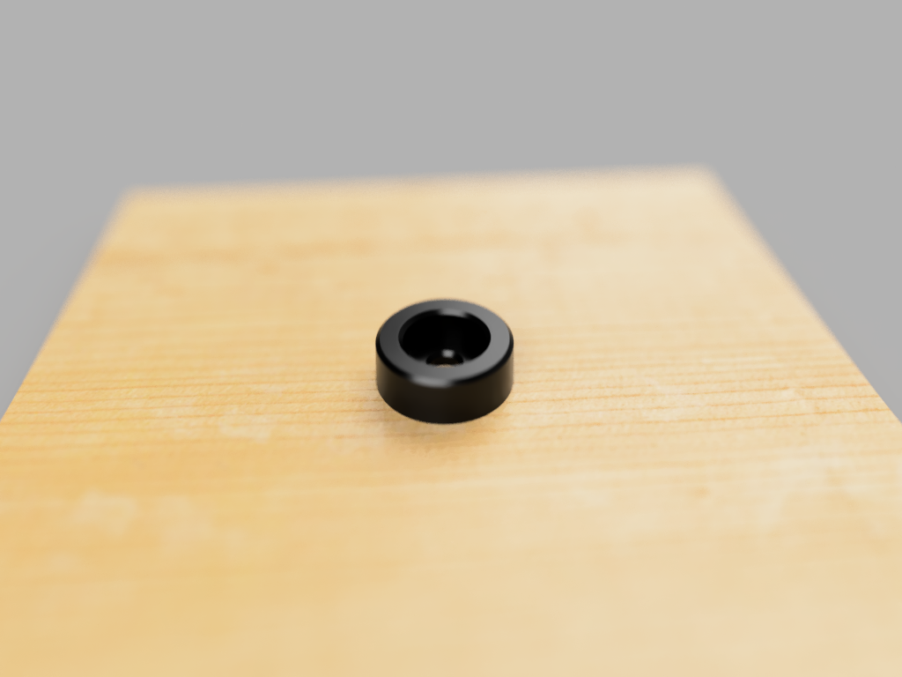

# Couch Foot

Most low cost reclining couches in the US consist of seperate chair-sized modules bolted to an angle-iron track.  This plastic foot goes over the M6 or M7 bolts through the angle iron that hold the module to support the couch and prevent the screws from damaging the floor.

