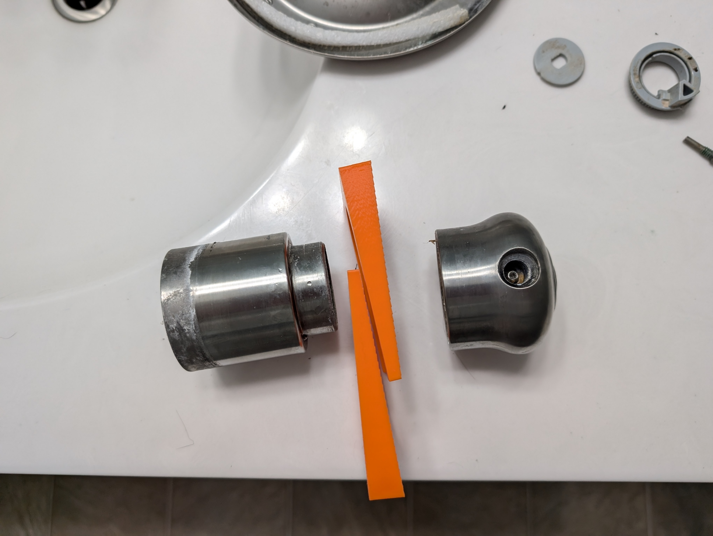

# Delta Shower handle removal wedges

I designed and used this tool to drive off a Delta shower handle. These knobs *should* come off easily after removing the retaining grub screw.  Unfortunately, where I live we have very hard water that will literally deposit limestone inside this mechanism and sieze the knob in place.  This tool is a set of wedges inspired by the wedges used to remove drill chucks. Driving the pair of wedges in together behind the knob successfully forced it off without damage.

## Usage

Place one wedge fully behind the knob, and the second, smooth sides together, as far in as it will go.  Then tap the second wedge in with a hammer until the knob is removed.

## Note

This is a last-ditch effort to remove the knob prior to cutting it off.  The force may cause the shaft to break or break the valve entirely. It worked for me, but may not work for everyone.
