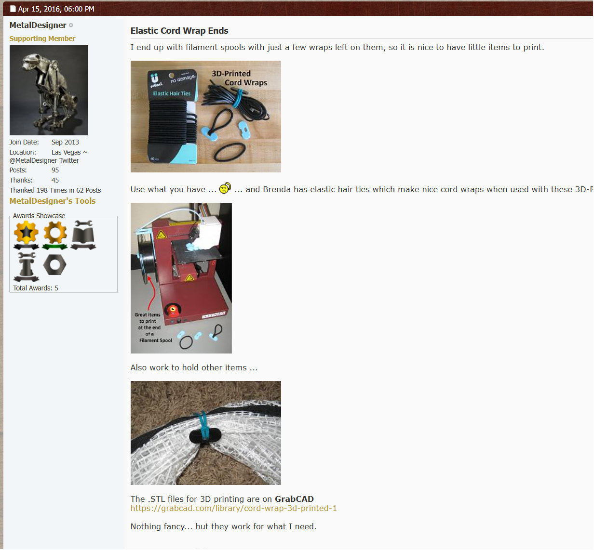
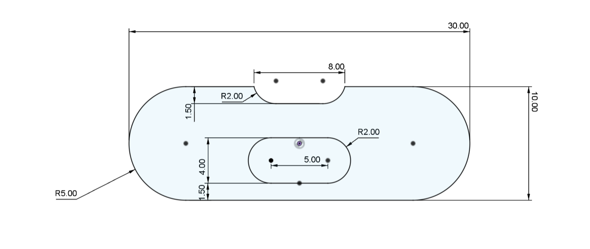
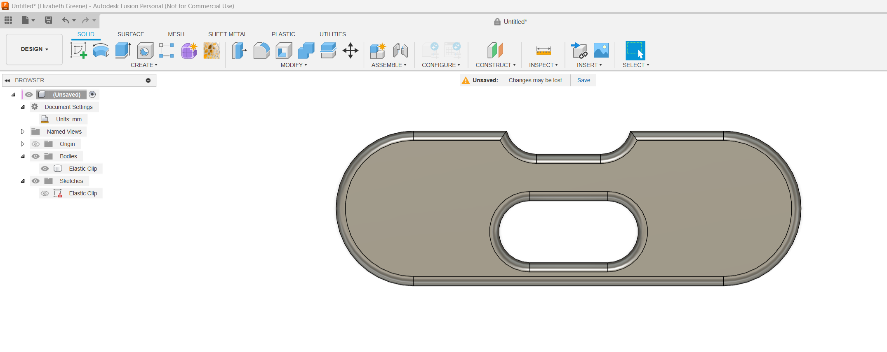

# Elastic Clip

This design is an Elastic cable/stuff wrap made from a small 3d print and elastic hair tie based on this cable  design from <https://www.homemadetools.net/forum/elastic-cord-wrap-ends-41648>. It's a useful tool and using the last dregs of filament on the end of a roll.  I recreated this when the original went 404.

