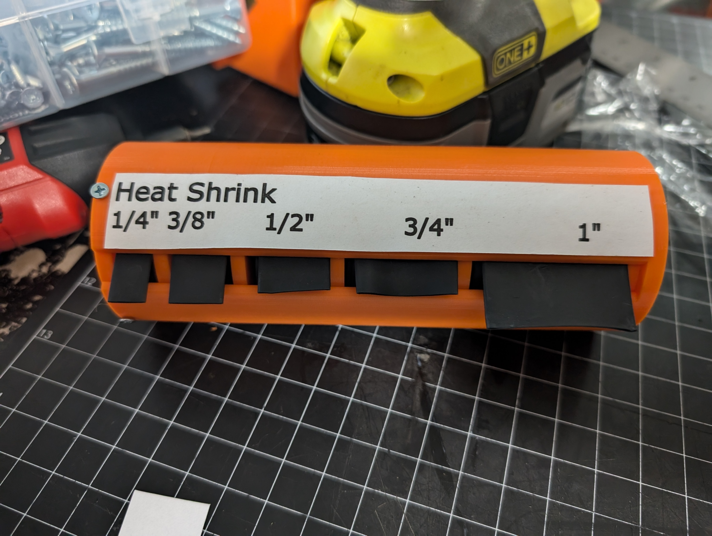

# HF Heat shrink holder

This is a rough draft of a printable holder for the spools of heatshrink that Harbor Freight sells.  It is a work in progress.  As-is it needs a several things fixed.

## Bugs/Suggestions for future work

* The tolerance stack-up on the spools meant that my spool stack was 2mm too long for this to assemble properly.
* There isn't enough meat around the screw holes to countersink them properly
* The whole thing would look better if it were e.g. hexagonal so it doesn't roll off the desk.
* Make the output slot smaller
* Add  holes for your fingers to wind up the spools
* Knurling the perimeter of the spools for grippiness
* Upload a pdf/DXF/SCG of the labels

## Assembly

* Wind the heatshrink onto the appropriately sized spools
* Stick the spools in the holder
* Attach the lid with 4 m3 screws
* * If your spool stack is too tall, cut a little bit off of each spool to shorten them.  Feel free to fix this with e.g. a little compliant mechanism and drop in a pull request
