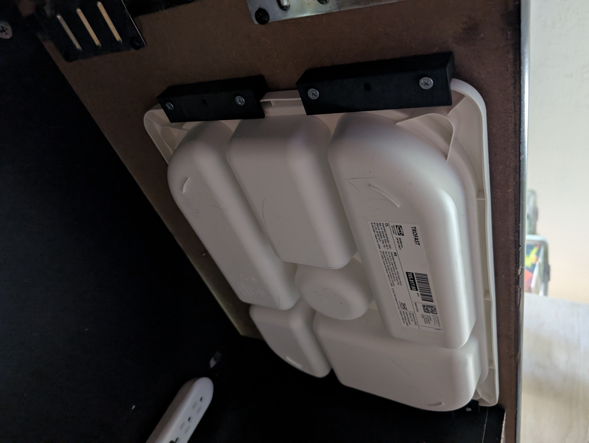
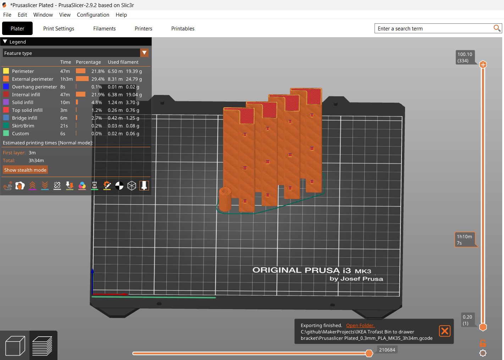

# IKEA Trofast Bin to drawer bracket

These brackets allow hanging a "Trofast" bin under a shelf or desk as a drawer.  It's designed to use #8-1 1/4 or #8-1 1/2 Pan head wood screws, and includes an optional bumper to prevent shoving the drawer back in too far.

## Suggestions for future work

If I ever use these in a high vibration environment, e.g. an RV, I might add a small compliant mechanism to help prevent the drawer from walking out.  It doesn't seem necessary for the current application and a small piece of self-adhesive felt would likely work just as well.

The vertical print orientation would allow a double-decker version that holds two bins, but that would require very long screws.