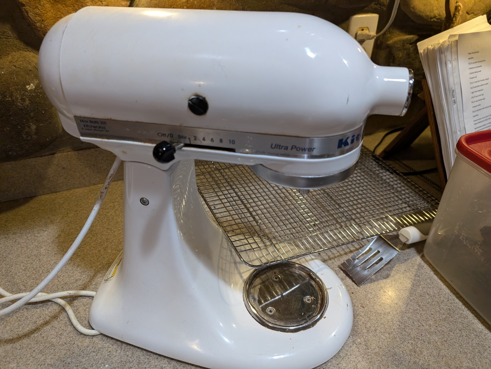

# Kitchenaid Mixer feet

My patient and longsuffering spouse's Kitchenaid Mixer's feet are failing, which results in an unacceptable kathonkathonkakathonka sound when making cookies.  Let's fix that.

## The old feet

Here's the best looking of the remaining three feet.

## Render

I designed it in Fusion 360, and my render skills are getting better!

## Redesign

I made one significant change from the original.  I made the "foot" that contacts the countertop much larger. I did this because TPU is much less "sticky" than the original rubber feet.  Increasing the area of the feet should increase the friction and help prevent the mixer from walking about.  I chose to keep the two best of the old rubber feet to help with this too.  These were designed to fit this mixer.  It should fit any Kitchenaid mixer with a 13 mm / 1/2 inch foot mounting hole.

... And here they are installed.  These were printed in Sunlu TPU. 0.3mm layer height, 0.4mm nozzle, 15% infill using the Prusaslicer "0.3 Draft" profile.  

## Suggestions for future work.

Any suggestions on how to increase the friction coefficient of TPU are welcome.  Sanding it didn't work.
