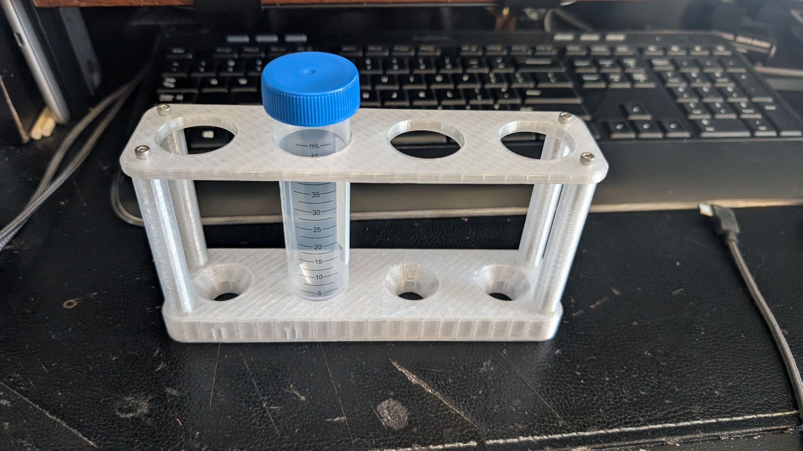

# A centrifuge tube rack designed for 50ml tubes

## Specifications

- **Configuration**: 1x4 layout (single row, four positions)
- **Hole Diameter**: 29.5mm
- **Height**: 95mm
- **Tube Capacity**: Designed for 50ml centrifuge tubes

