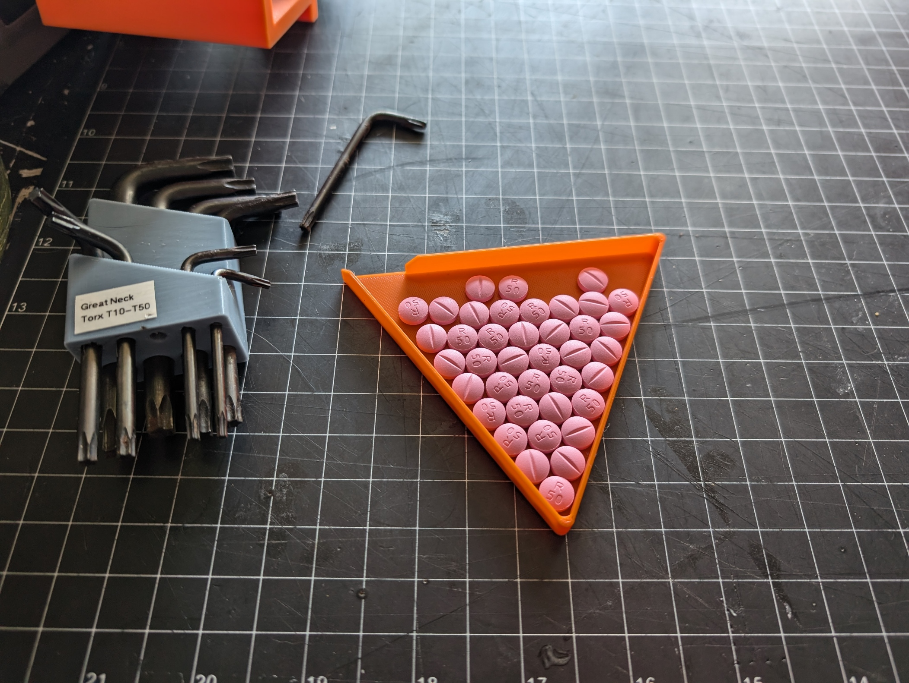

# 3D Printable Pill Counter

This design is based on this pill counter <https://x.com/Rainmaker1973/status/1842528876817154441>. To use it, dispense a quantity of round tablets into the tray and shake them so they fill the space from the bottom point up.  Count the number of full rows, look that value up in the chart below, and add the count of non-full rows.

| Rows | 1 | 2 | 3 | 4  | 5  |  6 |  7 |  8 |  9 |  10 |
|---|---|---|---|---|---|---|---|---|---|---|
| Count| 1 | 3 | 6 | 10 | 15 | 21 | 28 | 36 | 45 | 55 |

This image shows 8 rows = 36 plus 3 loose pills = 39 pills.
