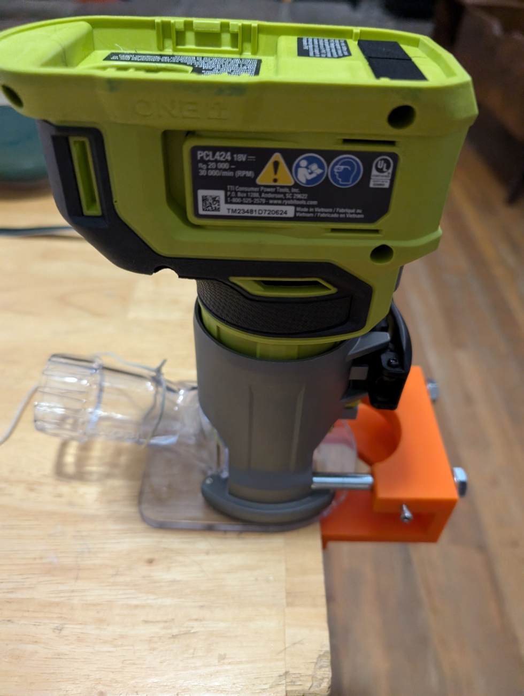
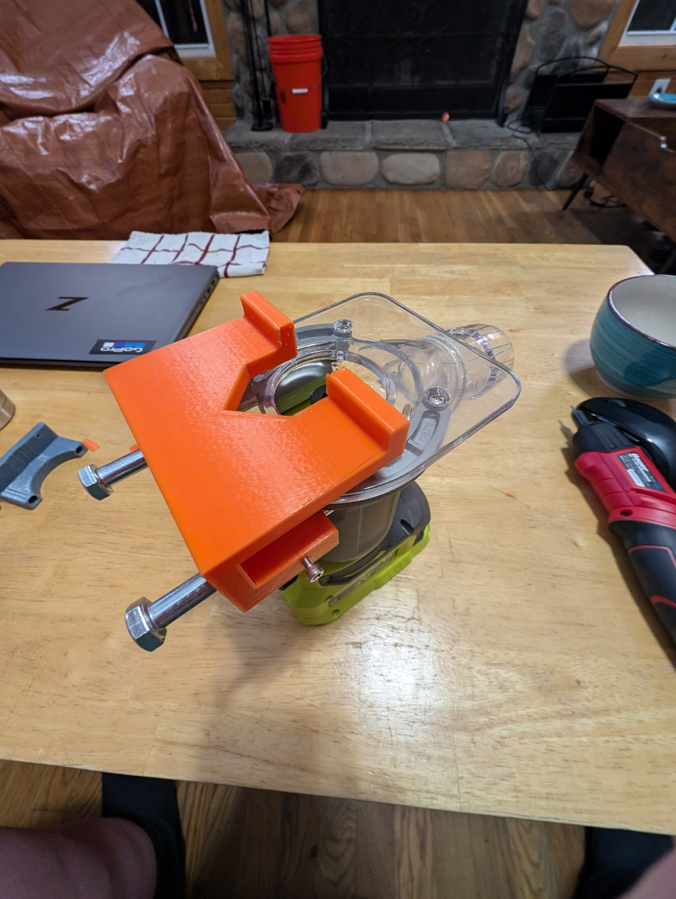
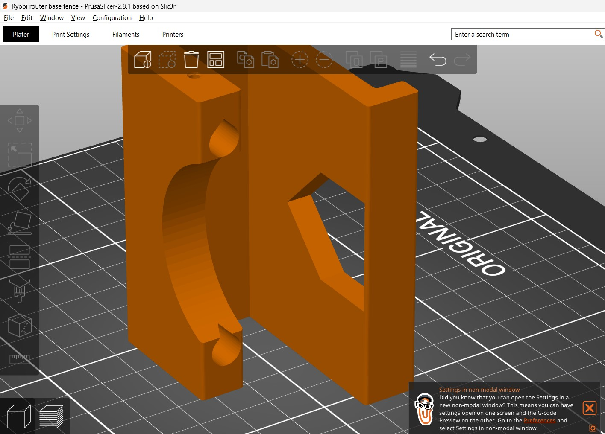

# Ryobi PCL424 Cordless Trim Router Adjustable Fence

Version 1.0.0

This tool attaches to a Ryobi cordless trim router to provide a router fence for using non-pilot router bits

## Danger

 Safety glasses are recomended whenever using power tools including this one.

## Bill of Materials

* 3D Printed part
* 2 M8 x 1.25mm x 90mm Bolts
  * I used this one from Bolt Depot, because I had it on hand.
    * <https://boltdepot.com/Product-Details?product=6233>
* 1 or 2 M3 x 10 mm Bolts or Socket Head Cap Screws
  * I used a screw from this kit from Amazon, because I had it on hand
    * <https://amzn.to/3Y1S7yp>

## Printing and assembly

The model includes the required support material to print in this orientation.

After printing, optionally cut away the two strips of support material with a utility knife.  Then secure the fence to the router with two M8 bolts.  Finally, loosely install one M3 bolt or screw into the side of the fence.

## Using the tool

With the router off and battery removed, install a router bit in the tool.  Then install the fence as described above.  Adjust the fence to the desired position and tighten the M3 bolt or screw to lock it in place.  Optionally, a second M3 bolt or screw can be installed on the opposite side for additional holding power.

## Suggestions for future work

* Some small knobs on the M3 and M8 fasteners would make tool-less installation easier.

## Changelog

* 1.0.0 - Initial Release
