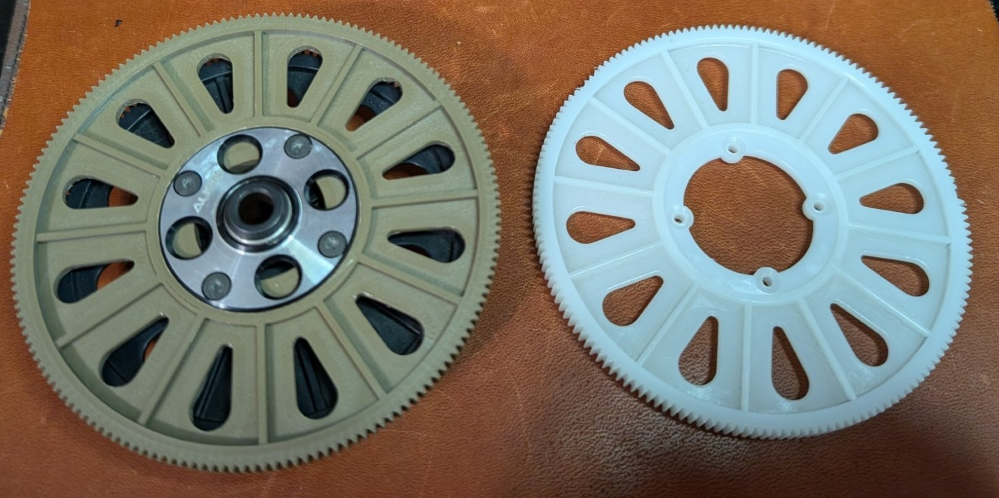

# T-Rex 500 CF Flybar Main Gear

Printed in Polymaker ASA 0.1mm layer height, 0.2mm nozzle diameter, 40% infill, 8 tops, 7 bottoms, 6 perimeters

This fits the old straight-gear flybar helicopter, not the newer helical gear models.

